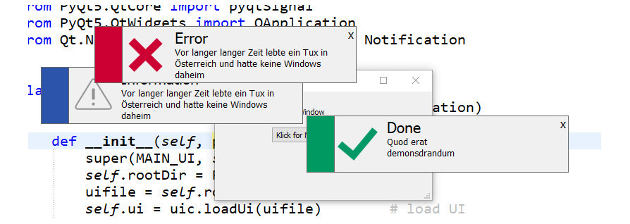
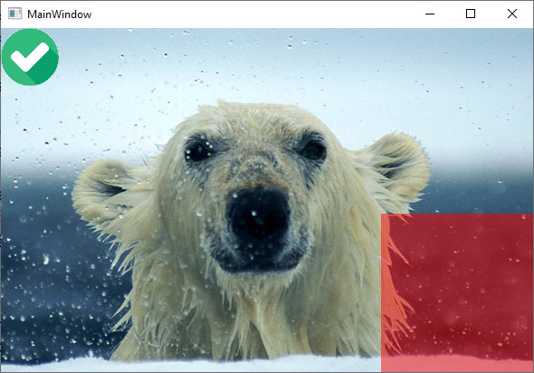

# PyStuff
some things markable for me to remember

## what you nedd
`pip install python-qt5 pyqt5-tools opencv-python`
that is usefull too
`pip install pipupgrade`

# QT/Notification
This is a QtDialog that simulates a notification on the screen.

## How to use it
In your Main Module you have to do this
```python3
from Notification import Notification_Core, Notification

n = Notification_Core()
notification = Notification(n)
notification.showInformation("MyMessage")
notification.showError("MyMessage")
notification.showWarning("MyMessage")
notification.showSuccess("MyMessage")
```
To get an idea how it looks like


# QT/OverlayIcons
Place an overlay Icon (*.png) for a QPixmap at a specific position.
You receive also an QPixmap that u can place somewhere in your QT App.
What u nedd is OpenCV > `sudo pip install opencv-python`.

## How to use it
```python3
self.cv = OpenCVLib()
icon = self.cv.readPNG("test/file_ok.png")
icon = self.cv.resizeTo(icon, 64, 64)
pixmap = self.cv.overlayIcon(self.ui.image.pixmap(), icon, 100, 10)
# write back
self.ui.image.setPixmap(pixmap)
```
To get an idea how it looks like


# QT/Splashscreen

This stuff is provided as it is, gl & hf!
